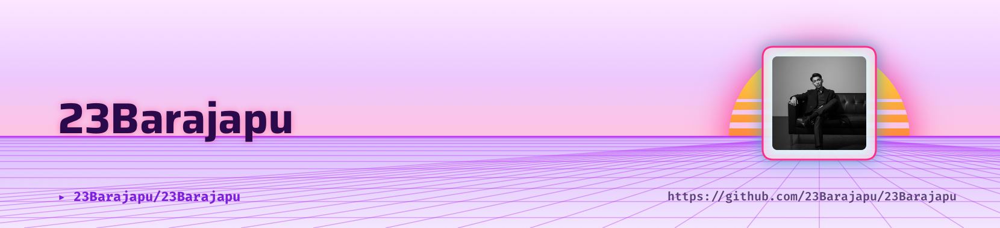

<div align="center">

<picture>
  <source media="(prefers-color-scheme: dark)" srcset="art/header-dark.png">
  
</picture>

<br>

# Hey there, I'm Bara 👋


<br>


</div>

---

# 🌸 About Me

<table>
<tr>
<td width="65%">

### 👨‍💻 Developer Profile

I'm a **Web & Mobile Developer / Fullstack Developer** who enjoys building scalable applications, modern web platforms, automation tools, and mobile solutions.

### 🚀 Current Focus

- Fullstack Web Development
- Mobile Application Development
- System Architecture
- API Development
- UI/UX Implementation
- Cloud Deployment
- DevOps & Automation

### 🎯 Interests

- Software Engineering
- Artificial Intelligence
- Open Source
- Mobile Technologies
- Cyber Security
- Digital Transformation

### 📍 Location

Indonesia 🇮🇩

</td>

<td width="35%" align="center">


</td>
</tr>
</table>

---

# ⚡ Tech Stack

<div align="center">

### Languages


### Frameworks & Libraries


### Mobile Development


### Databases


### Tools & DevOps


</div>

---

# 📊 GitHub Statistics

<div align="center">


</div>

---

# 🔥 GitHub Streak

<div align="center">


</div>

---

# 📈 Activity Graph

<div align="center">


</div>

---

# 🏆 Featured Projects

<div align="center">

| Project | Description |
|----------|-------------|
| 🖥️ Windows Deep Uninstaller & Root Cleaner | Advanced PowerShell-based Windows cleaning & optimization utility |
| 🌱 Tobacco Land Management Information System | Android-based agricultural management platform |
| 🛒 Tobacco Marketing Information System | Marketing, SCM & CRM system built with Laravel |
| 🚗 Biro Jasa Mahkota | Vehicle tax & administration management platform |
| 💰 Money Management App | Personal finance mobile application using React Native |

</div>

---

# 🐍 Contribution Snake

<div align="center">


</div>

```yaml
# GitHub Action Example
# Generate contribution snake automatically

name: Generate Snake

on:
  schedule:
    - cron: "0 */12 * * *"

jobs:
  build:
    runs-on: ubuntu-latest

    steps:
      - uses: Platane/snk@master
```

---

# 🤝 Connect With Me

<div align="center">

<a href="https://github.com/23Barajapu">

</a>

<a href="mailto:your-barajapu23@gmail.com">

</a>

<a href="#">

</a>

<a href="#">

</a>

<a href="#">

</a>

<a href="#">

</a>

</div>

---

<div align="center">

### 💫 "Code. Build. Learn. Repeat."

</div>


