<!-- Generated by GitHub Profile Agent Console. Edit profile.config.json, then run npm run generate. -->

  <picture>
    <source media="(max-width: 760px) and (prefers-color-scheme: dark)" srcset="./assets/hero/agent-console-d2917050-mobile-dark.svg">
    <source media="(max-width: 760px)" srcset="./assets/hero/agent-console-d2917050-mobile-light.svg">
    <source media="(prefers-color-scheme: dark)" srcset="./assets/hero/agent-console-d2917050-dark.svg">
    <source media="(prefers-color-scheme: light)" srcset="./assets/hero/agent-console-d2917050-light.svg">
    
  </picture>

  

## About Me

Saya menciptakan antarmuka web yang responsif, intuitif, dan menarik secara visual menggunakan React, HTML, CSS, dan Laravel.

Berfokus pada pengalaman web yang cepat dan modern dengan kode yang bersih, terstruktur, dan performa tinggi.

## Current Focus

| Area | What I am exploring |
| --- | --- |
| **Frontend Development** | Membangun UI responsif & interaktif dengan React, Next.js, TypeScript, HTML5, dan CSS. |
| **Web Development** | Mengembangkan aplikasi web full-stack dan REST API dengan Node.js, Laravel, PHP, dan MySQL. |
| **UI/UX & Performance** | Optimalisasi performa web, struktur kode yang mudah dipelihara, dan pengalaman pengguna yang mulus. |

## Featured Work

| Project | Focus | Why it matters |
| --- | --- | --- |
| [**Tobacco Land MIS**](https://mobile.tembakaucaringin.com/) | AgriTech & GIS Mobile App | Sistem Informasi Manajemen & Pengambilan Keputusan Lahan Tembakau berbasis Mobile & GIS. |
| [**Tobacco Marketing**](https://tembakaucaringin.com/) | E-Commerce & Supply Chain | Sistem Informasi Pemasaran & Manajemen Hubungan Pelanggan Produk Tembakau. |
| [**Biro Jasa Mahkota**](https://bjmahkota.com/) | Service Information System | Sistem Biro Jasa Layanan Pengurusan STNK, BPKB, Balik Nama, dan Mutasi Kendaraan. |
| [**Money Management**](https://money-management-xi-three.vercel.app/) | Financial Web App | Aplikasi pencatatan keuangan multi-wallet, manajemen anggaran, dan analisis laporan PDF via email. |

## Research Direction

Membangun antarmuka web modern yang menggabungkan estetika desain dengan arsitektur kode yang bersih dan responsif.

## Tech Stack

`React` · `Python` · `Node.js` · `HTML5` · `PHP` · `MySQL` · `TypeScript` · `JavaScript`

## Recent Activity

<!-- AUTO:ACTIVITY:START -->
- Aug 19, 2026: created a branch in [23Barajapu/FPSBench](https://github.com/23Barajapu/FPSBench).
- Aug 18, 2026: pushed 1 commit to [23Barajapu/PA](https://github.com/23Barajapu/PA).
- Aug 18, 2026: pushed 1 commit to [23Barajapu/money-management](https://github.com/23Barajapu/money-management).
- Aug 18, 2026: pushed 1 commit to [23Barajapu/bara-portfolio](https://github.com/23Barajapu/bara-portfolio).
- Aug 18, 2026: created a branch in [23Barajapu/PA](https://github.com/23Barajapu/PA).
- Aug 17, 2026: pushed 1 commit to [23Barajapu/cleaner-windows](https://github.com/23Barajapu/cleaner-windows).
<!-- AUTO:ACTIVITY:END -->

---

  Building thoughtful systems and sharing what works.

